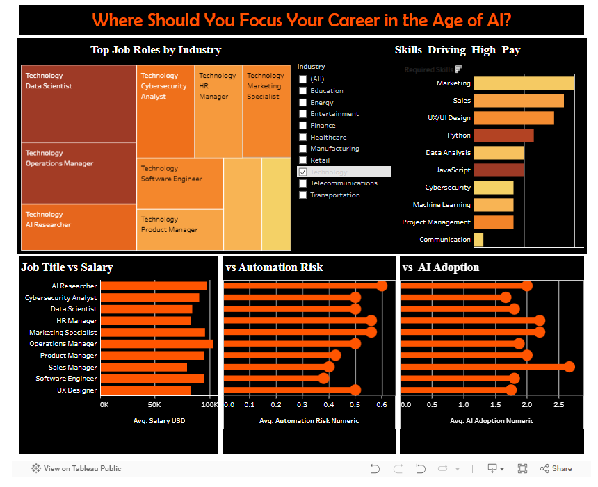

# Where Should You Focus Your Career in the Age of AI?

**Author:** Dhanalakshmi Kannur Munirathnam  
**Course:** BIS 582 – Data Visualization (Central Michigan University)  
**Tool:** Tableau  
**Dataset:** Combined datasets on job salaries, automation risk, and AI adoption rates  

---

## 📊 Project Overview
This Tableau dashboard provides a strategic overview of **career opportunities in the AI-driven job market**.  
It visualizes how industries and roles vary by **salary potential, automation vulnerability, and AI adoption rate**, helping users identify future-proof skills and roles.

---

## 🎯 Key Insights
- **Technology and Finance** dominate in high-paying roles with strong AI integration.  
- **AI Researchers, Data Scientists, and Software Engineers** have the highest average salaries ($90 K – $100 K USD).  
- Roles with **low automation risk** but **high AI adoption** (e.g., Product Manager, Data Analyst) offer stable, growth-oriented career paths.  
- **Python, Machine Learning, and Data Analysis** rank among the top skills driving high pay.  

---

## 🗺️ Dashboard Components
1. **Treemap:** Top job roles by industry  
2. **Bar Chart:** Skills contributing to higher salaries  
3. **Comparative Charts:** Job Title vs Salary, Automation Risk, and AI Adoption  
4. **Filter Panel:** Explore industries and skill categories interactively  

---

## 🧠 Tableau Techniques Used
- Multi-metric dashboard integration (Salary vs Risk vs Adoption)  
- Color-coded encoding for risk and adoption tiers  
- Filters and highlight actions for industry and skill categories  
- Dashboard layout with dark theme for visual contrast and focus  

---

## 🌐 View Interactive Dashboard
[View on Tableau Public →](https://public.tableau.com/views/project1_17607328837390/Dashboard1?:language=en-US&publish=yes)

---

## 📷 Preview

---

## 📂 Files
| File | Description |
|------|--------------|
| `project.twb` | Tableau workbook |
| `tableau_ai_job_market_insights.png` | Dashboard screenshot |

---

## 💡 Reflection
This project deepened my understanding of **multi-dimensional data storytelling**—combining economic, technological, and workforce factors in one cohesive visual.  
It showcases how **data visualization** can guide strategic decision-making in emerging AI-driven industries.
